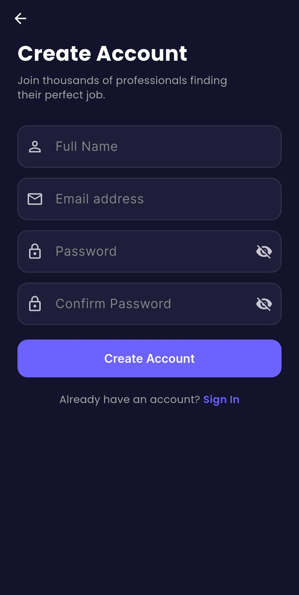
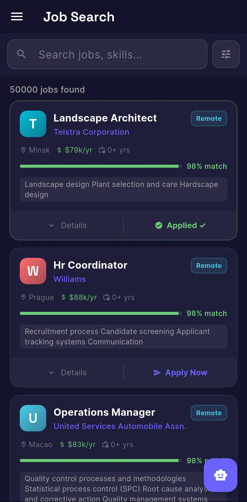
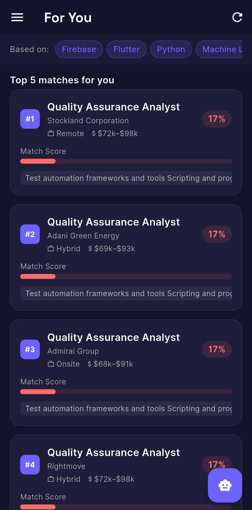
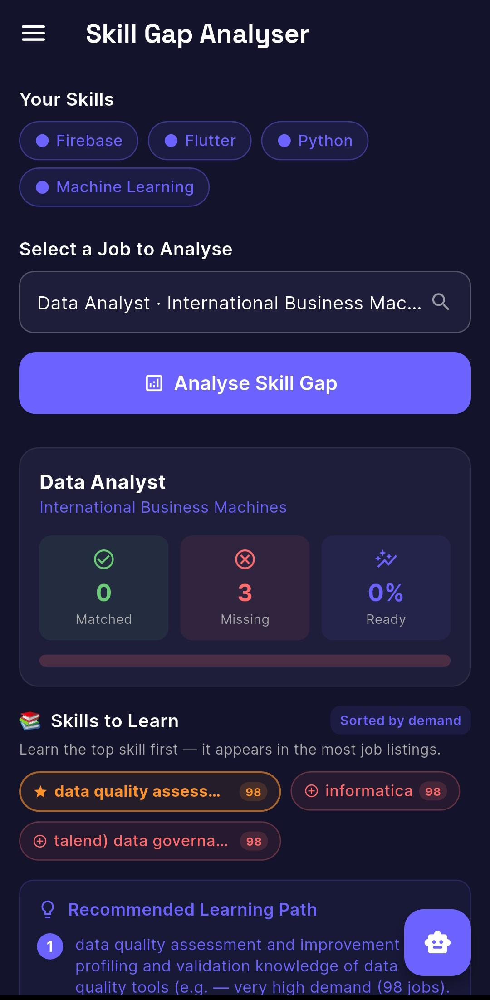
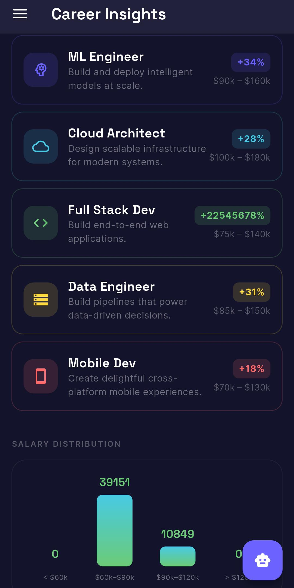
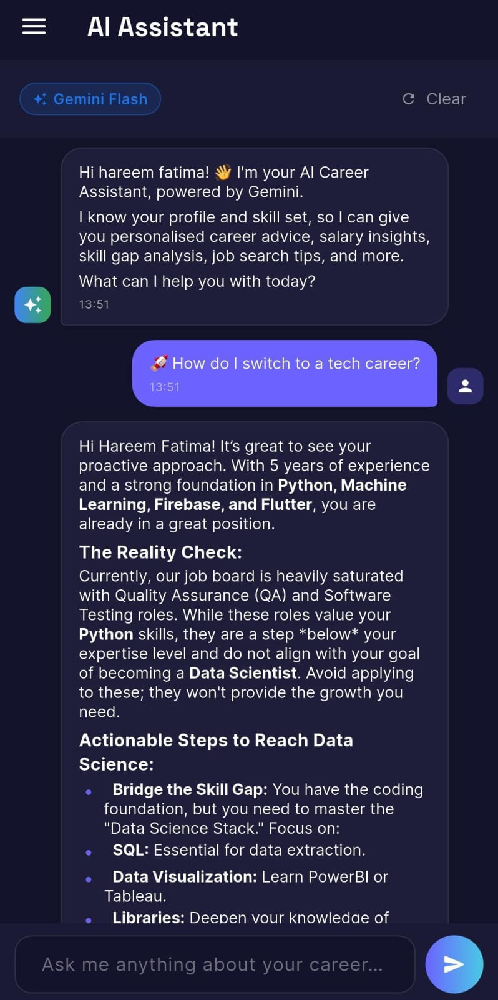

# Smart Job Recommender System

A full-stack AI-powered mobile application that matches users to relevant job opportunities based on their skills, identifies skill gaps for target roles, and provides an AI career coaching chatbot — built with Flutter and a Python ML backend.

>  Flutter · Python · Firebase · Gemini AI

---

## Table of Contents

- [Features](#features)
- [Tech Stack](#tech-stack)
- [System Architecture](#system-architecture)
- [Folder Structure](#folder-structure)
- [Installation Guide](#installation-guide)
- [API Reference](#api-reference)
- [Screenshots](#screenshots)
- [Future Improvements](#future-improvements)
- [Author](#author)

---

## Features

- **ML-Powered Job Recommendations** — TF-IDF vectorisation with cosine similarity matches users to the most relevant jobs based on their skill set
- **Skill Gap Analyser** — Compares a user's skills against a target job's requirements; shows matching and missing skills ranked by market demand
- **Local Weighted Ranking** — Offline scoring system weighing skill overlap, keyword relevance, work type preference, and experience fit
- **AI Career Chatbot** — Multi-turn conversational assistant powered by Google Gemini 2.0 Flash Lite with a career-focused system prompt
- **Career Insights Dashboard** — Visual analytics: jobs by work type, top countries/roles, average salary by role, posting trends, experience distribution, top skills
- **Trending Skills** — Real-time demand map computed from 25,000 job listings bundled in the app
- **Firebase Authentication** — Secure email/password sign-up and login
- **User Profile & Skill Management** — Stored in Firestore; skills drive both recommendations and skill gap analysis
- **Offline-First Design** — All core features fall back to local computation if the Flask server is unreachable
- **Performance Optimised** — Heavy JSON parsing and scoring run in background isolates via Flutter's `compute()`, keeping the UI thread free

---

##  Tech Stack

| Layer | Technology |
|---|---|
| Mobile Frontend | Flutter (Dart), Provider |
| Authentication | Firebase Auth |
| Cloud Database | Cloud Firestore |
| ML Backend | Python, Flask, scikit-learn |
| NLP / Similarity | TF-IDF Vectoriser, Cosine Similarity |
| AI Chatbot | Google Gemini 2.0 Flash Lite API |
| Data Source | Kaggle Job Descriptions Dataset |
| Preprocessing | Pandas, NumPy |
| State Management | Provider (ChangeNotifier) |

---

## System Architecture

The system is divided into three layers that work together:

```
┌─────────────────────────────────────────────────────┐
│                Flutter Mobile App                   │
│  Auth · Job Search · Recommendations · Skill Gap    │
│  Trending Skills · Career Insights · AI Chatbot     │
└──────────────┬────────────────────┬─────────────────┘
               │  HTTP (REST)       │  Firebase SDK
               ▼                   ▼
┌──────────────────────┐  ┌─────────────────────────┐
│   Flask ML Backend   │  │   Firebase Cloud        │
│   /recommend         │  │   Auth · Firestore      │
│   /skill_gap         │  └─────────────────────────┘
│   /stats · /job/<id> │
│   TF-IDF · Cosine    │         ┌──────────────────┐
│   Similarity         │         │  Gemini 2.0 API  │
└──────────────────────┘         │  Career Chatbot  │
                                 └──────────────────┘
```

**Data flow:**
1. A one-time preprocessing script cleans the raw Kaggle CSV and produces two JSON files — a 50k-job dataset for Flask's ML engine and a 25k stratified sample bundled into the APK as an offline asset.
2. Flask loads the full dataset at startup, builds the TF-IDF matrix once in memory, and serves inference via REST endpoints.
3. The Flutter app calls Flask for ML features and Firebase for auth/profile; all features degrade gracefully to local computation if Flask is offline.

---

## Folder Structure

```
smart-job-recommender/
│
├── backend/
│   ├── app.py                   # Flask REST API (TF-IDF, endpoints)
│   ├── preprocess_dataset.py    # Data cleaning & JSON export script
│   ├── jobs.json                # 50k jobs — used by Flask ML (not committed)
│   └── jobs_flutter.json        # 25k jobs — bundled into APK (not committed)
│
├── lib/
│   ├── main.dart                # App entry point, Firebase init, routing
│   ├── firebase_options.dart    # Auto-generated Firebase config
│   │
│   ├── models/
│   │   ├── job_model.dart       # Job data model with fromJson / copyWithMatch
│   │   └── user_profile_model.dart
│   │
│   ├── services/
│   │   ├── app_provider.dart    # Global ChangeNotifier — state, auth, lazy load
│   │   ├── job_service.dart     # Load, filter, rank, Flask calls, skill gap
│   │   ├── auth_service.dart    # Firebase Auth wrapper
│   │   └── profile_service.dart # Firestore profile CRUD
│   │
│   ├── screens/
│   │   ├── home_screen.dart
│   │   ├── login_screen.dart
│   │   ├── signup_screen.dart
│   │   ├── job_search_screen.dart
│   │   ├── recommendation_screen.dart
│   │   ├── skill_gap_screen.dart
│   │   ├── trending_skills_screen.dart
│   │   ├── career_insights_screen.dart
│   │   ├── notifications_screen.dart
│   │   ├── profile_screen.dart
│   │   ├── settings_screen.dart
│   │   └── chatbot_screen.dart
│   │
│   ├── widgets/
│   │   ├── job_card.dart
│   │   └── filter_bottom_sheet.dart
│   │
│   └── utils/
│       ├── app_constants.dart   # API URLs, keys, asset paths
│       └── app_theme.dart
│
└── assets/
    └── data/
        └── jobs.json            # 25k-job Flutter asset (copy of jobs_flutter.json)
```

---

## Installation Guide

### Prerequisites

| Tool | Version |
|---|---|
| Flutter SDK | ≥ 3.x |
| Dart | ≥ 3.x |
| Python | ≥ 3.9 |
| Firebase CLI | Latest |
| Android Studio / Xcode | Latest |

---

### 1. Clone the repository

```bash
git clone https://github.com/your-username/smart-job-recommender.git
cd smart-job-recommender
```

---

### 2. Set up Firebase

1. Create a project at [console.firebase.google.com](https://console.firebase.google.com)
2. Enable **Email/Password** authentication
3. Create a **Firestore** database (start in test mode)
4. Run `flutterfire configure` to generate `firebase_options.dart`
5. Place `google-services.json` in `android/app/` and `GoogleService-Info.plist` in `ios/Runner/`

---

### 3. Set up the Python backend

```bash
cd backend

# Create and activate a virtual environment
python -m venv venv
source venv/bin/activate        # macOS/Linux
venv\Scripts\activate           # Windows

# Install dependencies
pip install flask flask-cors scikit-learn numpy pandas

# Download the Kaggle dataset
# https://www.kaggle.com/datasets/ravindrasinghrana/job-description-dataset
# Place job_descriptions.csv in backend/

# Generate JSON files
python preprocess_dataset.py
# Without the CSV, a 100-job sample is generated automatically

# Copy Flutter asset
cp jobs_flutter.json ../assets/data/jobs.json

# Start the Flask server
python app.py
```

The API will be available at `http://localhost:5000`.

> **Android Emulator Note:** The emulator maps `10.0.2.2` to your machine's localhost. The app is pre-configured to use this address.

---

### 4. Configure API keys

Open `lib/utils/app_constants.dart` and set your Gemini API key:

```dart
static const String geminiApiKey = 'YOUR_GEMINI_API_KEY_HERE';
```

Get a free key at [aistudio.google.com](https://aistudio.google.com/app/apikey).

---

### 5. Run the Flutter app

```bash
# Install Flutter dependencies
flutter pub get

# Run on a connected device or emulator
flutter run
```

---

## API Reference

Base URL: `http://10.0.2.2:5000` (emulator) or your machine's local IP for a physical device.

### `POST /recommend`

Returns top-N job recommendations based on cosine similarity with the user's skills.

**Request body:**
```json
{
  "skills": ["Python", "Flask", "PostgreSQL"],
  "top_n": 5,
  "work_type": "Remote",
  "min_salary": 80000,
  "max_experience": 5
}
```

**Response:**
```json
{
  "recommendations": [ { "id": 1, "job_title": "...", "match_percentage": 87.3, "..." : "..." } ],
  "total_matched": 5
}
```

---

### `POST /skill_gap`

Compares user skills against a specific job's requirements.

**Request body:**
```json
{
  "user_skills": ["Python", "Flask"],
  "job_id": 42
}
```

**Response:**
```json
{
  "job_title": "Backend Engineer",
  "matching_skills": ["Python", "Flask"],
  "missing_skills": ["Docker", "Kubernetes"],
  "match_percentage": 50.0
}
```

---

### `GET /stats`

Returns aggregated analytics for the career insights dashboard.

**Response fields:** `total_jobs`, `jobs_by_work_type`, `jobs_by_country`, `jobs_by_role`, `avg_salary_by_role`, `jobs_posted_by_month`, `experience_distribution`, `top_skills`

---

### `GET /job/<id>`

Returns the full job record including description, responsibilities, benefits, and company profile.

---

### `GET /health`

Returns server status, number of jobs loaded, and TF-IDF feature count.

---
## Screenshots

## Screenshots

<p align="center">
  
  
  
</p>

<p align="center">
  
  
  
</p>

---


##  Future Improvements

- [ ] **Resume parser** — extract skills automatically from an uploaded PDF CV
- [ ] **Push notifications** — alert users when new jobs matching their profile are posted
- [ ] **Job bookmarking** — save and manage favourite listings with Firestore
- [ ] **Advanced filters** — filter by country, company size, salary currency
- [ ] **Model upgrade** — replace TF-IDF with a sentence-transformer embedding model (e.g. `all-MiniLM-L6-v2`) for semantic similarity
- [ ] **Deployed backend** — host Flask on Railway, Render, or AWS so the app works without a local server
- [ ] **Multi-language support** — internationalisation for a global user base
- [ ] **Apply integration** — deep-link directly to job application pages

---


## Contributors

- **Misbah Shaheen** 
- **Hareem Fatima**
  GitHub: [HareemFatima5](https://github.com/HareemFatima5)

---

## License

This project is for academic purposes. All rights reserved © 2026.
